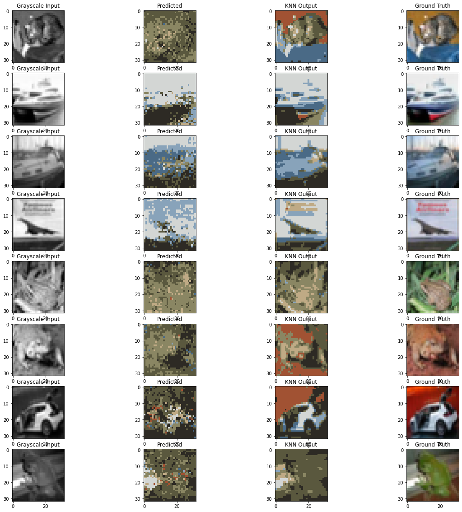

# CNN-Image-Colorizer
Colorizing black and white images. Training and validation images are sourced from the <a href='http://www.cs.toronto.edu/~kriz/cifar.html'>CIFAR-10</a> dataset.

### Iteration 1 Results
Clustered RGB pixels using KNN (k=4). Trained a CNN with 4 convolutional layers and subsequent flattening. The result:
 
 